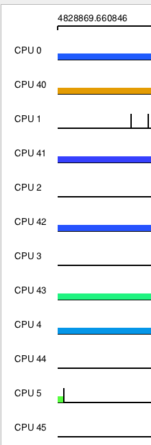
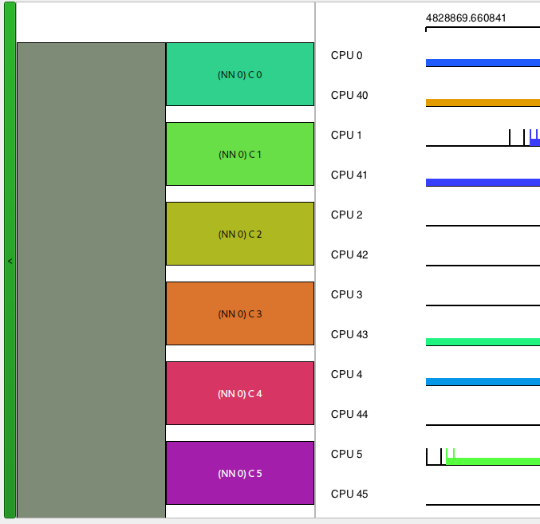
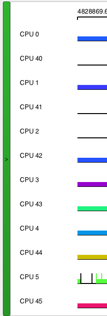

# Purpose

Visualise topology of a stream, from which we are reading trace data to get more information where a
task ran or which CPU and therefore NUMA node was working more than others. Visualisation should
not battle with other parts of KernelShark's visualisations, at best rearrange some graphs, but
not their data.

# Terms
Below are terms introduced with this modification. Other KernelShark terms, e.g. stream, will not be
explained. Not all terms are 1:1 with hwloc's terms. They are explained to get an idea of them when
used in text.

*Block tree* - Blocks next to each other forming a tree. Best to show it with a visualisation:
```
|------|-----------|------|
|      |           | leaf |                         leaf
|      |           |------|                        /
|      | rootchild |                      rootchild
|      |           |------|              /         \
|      |           | leaf |             /           leaf
|      |-----------|------|            /
| root |                      =    root
|      |-----------|------|            \
|      |           | leaf |             \           leaf
|      |           |------|              \         /
|      | rootchild |                      rootchild
|      |           |------|                        \
|      |           | leaf |                         leaf
|------|-----------|------|
```
*Brief topology* - Topology with only the most necessary parts for a NUMA tree visualisation, that
being indices of NUMA nodes paired with their cores, which are represented by their logical indices
paired with their PUs, which are represented by their logical indices paired with their OS indices.
*C* - Label noting a core node in the topology tree. Usually followed by a number of its logical index.
*Core* - Structure containing one or more PUs in a hwloc topology. On systems with only one 1 PU per
core, e.g. where hyperthreading is disabled, they are interchangeable.
*GL widget* - OpenGL widget used by KernelShark to plot its CPU and task graphs.
*Logical index* - Index given to a part of the topology by hwloc during topology discovery. Together
with object type (i.e. core, NUMA node, PU), they form a unique identifier of a component in a given
topology.
*M* - Label noting a Machine node in the topology tree. This node is the root of the topology tree
for a given stream. This node is colored like the stream would be if multiple streams were present
in a given session.
*NN* - Label noting a NUMA Node node in the topology tree. Color of these nodes is an average of the
colors of its cores.
*Node* - Refers to either a structure containing cores in a topology (group, package or a NUMA node)
or a topology tree node, explained below.
*Node node* - Type of item at the layer below the root and above the core level. For NUMA TV, they
are currently interchangeable for NUMA node nodes.
*NUMA TV* - NUMA Topology Views, shortened.
*NUMA TV Context* - Configuration object for a KernelShark process, which manages per stream
configurations of which topologies are loaded, if any, and what view a stream is requesting to be
used during topology visualisation.
*OS index*
*Package* - Physical place where cores are installed (according to hwloc). Another type of a node in
a topology.
*PU* - Processing unit, in hwloc analogous to what KernelShark would call a CPU. Can be grouped in a core.
*Topology* - Structure detailing memory modules, CPUs and other devices on a machine. E.g. machine has
one package, which has four cores, each with just one PU. First two cores are also under the same NUMA
node and the other two are under another NUMA node. The machine's name is Greg and it has 512 GB of total
memory.
*Task padding* - Additional height of a topology widget used when KernelShark displays tasks for a stream.
*Topology tree* - Qt widgets and layouts displayed as a block tree, root being a machine tree node, root's
children are Node nodes and cores are tree's leaves. For a NUMA topology, Node nodes are NUMA node nodes.
Topology trees are always a part of a topology widget.
*Topology tree node* - Node of a block tree visualising a brief topology.
*Topology visualisation* - Interchangeable with topology tree.
*Topology widget* - Qt widget with a topology tree and possibly task padding, shown in the wrapper topology
widget, class KsStreamNUMATopology.
*Trace graph* - Qt widget housing GL widget, wrapper topology widget and controls for the GL widget, class
KsTraceGraph.
*View/view type* - Enumerated option of how to display topology of a stream. Default view is what KernelShark
used before this modification (and can be achieved still).
*Wrapper topology widget* - Shown to the left of KernelShark's GL widget (with the classic KernelShark
graphs), contains topology widgets in a vertical top-down layout.

# Design

## Main design objectives

- Keep existing KShark API
- Configuration-visualisation layers
- Don't change data, only visualisation
- Opt-in usage
- Synchronisation with GL widget's graphs
- Qt utilisation

## Design overview

Modification can be broadly divided into two communicating components - configuration & visualisation.

Configuration component keeps topology and view data data for each stream (or lack thereof).
Visualisation component uses configuration's data and GL widget's data to show, change, delete or hide
topology information to relevant CPU graphs in the GL widget.

Each stream may own (0-1) configurations and (0-1) visualisation at a time.

Visualisation never changes data of configuration.

Configuration is the only component to use hwloc.

Both components are owned by the trace graph of KernelShark.

Configuration of a stream can be queried and potentially changed via public API, visualisations can
only be hidden or emptied out by public API.

See figure 1 for the modification's diagram.


Figure 1.

### Discarded ideas

#### Topology tree inside the GL widget

This was actually attempted first - with disastrous results. To change the GL widget's
layout and drawing, a lot more gutting of KernelShark source code would have to be done
and when the scope has shown itself in its full glory, this design approach was scrapped
in favour of an approach using Qt objects. Repositioning everything in the GL widget
versus just resizing the scroll area inside of which the GL widget resides (and on which
it also heavily depends for sizes) saw a victor in the simpler option in the end.

#### Wrapper topology widget always visible

Wrapper topology widget and the hide button were briefly always visible, no matter whether
every stream wished for a DEFAULT view or not. This was changed so that a totally empty
wrapper topology widget wouldn't waste space, along with the hide button, which would
lose meaning if there is nothing to hide to begin with.

#### Topology configurations as a singleton

For most of the development, topology configurations were stored in a singleton.
This allowed easy access all across the code and a single instance of configurations.
Even this document was almost finished defending it - but then the thought of a plugin
using NUMA TV configurations formed. Essentially, as static data, the topology
configurations would exist for each shared object independently, breaking
singleton's use as a single instance of a class in the full KernelShark context.

To prevent this, trace graph became the owner of topology configurations, where it
ensured only one existence of the topology configurations context object for a single
KernelShark main window, which was exactly what fixed the staticness issue.

Lesson to learn from this is to consider every angle when using a singleton - and
if it is already used, make sure that getting its instance is as limited as possible.
If not for safety, then at least for easy refactoring into code without a singleton.

#### PU column in topology widgets

There used to be four levels for a topology tree, where PUs would connect to
CPUs in the GL widget and take on the CPU's color. This idea was discarded for
three reasons:
1. There was color overload on the screen, which made using the
   topology tree for reading information less user-friendly.
2. CPUs are already always displayed by KernelShark, unless all of them are
   hidden (in which case the topology tree would hide the corresponding PUs
   as well).
3. Toplogy tree demanded more space than was planned and the GL widget was
   too narrow. This would take attention away from KernelShark's main purpose.
   to visualise trace data.

Displaying said column was deemed as redundant, so only the
machine root, NUMA node level and core level were left.

#### Classic Qt tree for the topology trees

Qt offers a tree widget out of the box, which KernelShark uses for
simple event filtering. These widgets offer item-wise collapsibility
and already draw relations of parent-child.

But their customisability options weren't as attractive as creating
block trees for topology trees.

#### Topology configurations as part of kshark_data_stream type

Each stream is related to one topology configuration and one topology widget.
Streams were therefore a primary candidate for owning these items. However,
kshark_data_stream type is a C struct and it would take too much code just
to create some sort of communication between the two languages.

Final decision was made when the semantics of the data stream struct were
considered - it is about trace data that KernelShark will be visualising.
On the other hand, NUMA TV is about visualising topologies and has no relation
to data otherwise.

As such, maps with stream IDs as keys and configurations or widgets as values
were chosen instead.

#### Package view

This is still a possibility and with a simple change in current source code,
would be achievable as well. Only the label on NUMA node nodes in the topology
tree and type of items hwloc should search for would have to change.

It is left as an extension, as this was not part of the specification (and
the project is pressed for time).

## Questions and answers

Below are questions that may arise upon inspection of the modification.

### "Why use maps and not unordered maps?"

To properly sort which topology widget goes where, maps were deemed as
ideal, as they keep their items sorted by the key.

### "Why are topology widgets stored as pointers?"

Qt disables copying of widgets, which proved troublesome during development.

But Qt handles pointers well, as long as every pointed to object has a parent,
which is the case for this modifcation. When a parent is destroyed, so are
its alive children.

### "Why not use more of hwloc's topology data?"

It is unnecessary to load a lot of data for the goal of this modification,
which is only concerned with grouping of PUs, cores and NUMA nodes.

### "Why are there no other views?"

Frankly, because the modification was on a tight schedule. It is possible to
make more views, with changes:

1. Subclass StreamNUMATopologyConfig as a child of some abstract class,
   from which more StreamXYZTopologyConfigs would arise. Add a new class
   for the view.
2. Add a new item into the TopoViewType enumeration class specifying a view.
3. Add a radio button to KsNUMATVDialog.
4. Subclass KsStreamNUMATopology as a child of some abstract class, which would be
   held by KsTraceGraph. Add a new class for the view.

This sounds quick on paper, but it would take about an evening to properly implement
currently. While that is not a lot of work still, it is a design change, as
currently, the design fits only NUMA TV, no other topologies - hence it would
need also documentation changes, API changes, context semantics and so on.

### "Why aren't topology views more interactive?"

There were ideas about clicking on tree nodes and them hiding CPU graphs that belonged
to them. This would be rather easy to implement, but there is no reason to not do
that through KShark's existing GUI.

Adding more information to e.g. the tooltips would require more information from
hwloc to be passed, which was not necessary per specification.

### "Why divide the topology widgets from configuratons?"

To separate concerns. Widgets are only for displaying and can exist without a
configuration. Configurations change under different circumstances and exist to
inform topology widgets about how they should be drawn.

It would be possible to group them together in code as a pair under one
stream ID key, but the concerns would be less delimited. Price to pay
for the division is negligible.

### "Why use block trees?"

Block trees ensure that the tree node, which is a parent of another,
is always visible, whether you're scrolled all the way up or in the center or
all the way down. It makes hierarchy more explicit, improving information given
to the user.

It is also easier to create in Qt, which is a welcome bonus.

### "Why choose coloring for tree nodes as averages of their children?"

It gives a connection to the children while making sure each tree node can be
distinguished from others on its hierarchy level (e.g. Core 1 and Core 10 are
easily distinguishable by their color alone).

Of course, averages can make some colors duplicated by sheer coincidence, but
there would need to be many colors for that to happen.

### "Why aren't topologies with nested NUMA nodes supported?"

In short, they were deemed to exotic. Modification could be extended to
take care of these topologies as well though, with new topology configuration
types or more detailed definition of the existing configuration class (e.g.
each level could be an abstract data type, which either holds another mapping
to a topology item or a leaf mapping of PU logical indices to their OS indices).

Refactoring the code like this is left as an extension.

# Solution

A little more technical explanation of how things work instead of how they're used.

## Configuration

Each stream's configuration is stored by the NUMA TV context object
in the trace graph in an unordered map. This context is to be used
when asking for adding a new configuration, deleting an old configuration
or updating an existing configuration. It can also be queried for an
existence of a configuration and for an observer pointer to a
configuration.

### Observing a topology configuration

As the main owner of topology configurations, the NUMA TV context
does not wish to expose unwanted API that could delete the configurations.
Instead of a reference getter, the observer pattern is applied and an
observer pointer is given to anyone wishing to observe a stream's topology.

From the name alone, it is a discouragement to doing anything other than
reading data.

### Creating a topology configuration

NUMA TV introduces a new widget in KernelShark's widgets library, which
is a dialog window, where view type and topology file path may be specified.

If changes are applied through this dialog, the context is asked to add a
configuration with specified values to a stream. Path to the topology file must
be valid at least until the configuration application is finished, or no
new configuration will be created - with a really unlucky timing, it could
produce an error and crash the program.

Topology configuration will ask hwloc to interpret its XML topology file
and then cherry picks only NUMA nodes, their cores and PUs, compacting them
into a briefer topology, with only index mappings of these objects.

If this cannot be done, for whatever reason, the brief topology will be empty
and visualisation will never show anything. An error message will pop on the
standard error output though.

### Updating a topology configuration

When a new and valid topology file path is given to update a configuration,
it is instead created anew, as most previous data are invalid, and inserted
into the place of the old configuration.

If just the requested view of a stream is changed, only this value changes
in the currently applied topology and nothing new is created.

### Removal of topology configuration

Upon detecting that a topology file path given is empty, the topology
is destroyed (since there is nothing to use for topology data).

Other possibility is asking the trace graph to remove all of them
or by destroying the trace graph.

The trace graph may be asked to clear topology configurations by the main window
if a new session is being started via "Open trace" button.

### Lifetimes of topology configurations

Topology configurations may be born and die during a single stream's existence.

Topology configurations may not exist for a stream, if no topology file
was selected in the configuration dialog. This is a very light memory save,
as a string, a number and maps of maps for topologies will hardly need so
much storage that this would be a necessary feature.

Non-existent topologies make the program always behave as if a DEFAULT view
was chosen and no topology file was given, resulting in empty topology widgets.

## Visualisation

Trace graph is the one primarily responsible for visualisations,
as topology widget updates always occur when CPU redraws or task redraws
are being done. As the owner of both configuration and visualisation
components, every request for configurations happens inside it or is requested
through it.

### Location of wrapper topology widget

Wrapper topology widget is situated on the left of the GL widget. It is either
completely or hidden by the topology button. This way, the topology tree will
perfectly match with (possibly rearranged) CPU graphs of a stream.

### Creating a topology widget

Topology widgets are created from a stream's topology configuration, namely
from its brief topology data. Giving these to the constructor of a topology
widget will then construct the topology tree, first layer being the root with
a machine node (which also represents the stream, but uses hwloc terminology,
hence "machine"), then construction is something like depth-first search:
1. Find a NUMA node in the brief topology.
2. Find a core in the NUMA node.
3. Construct a core node from the data of its PUs and logical index.
4. Repeat steps 3-4 until all core nodes for a NUMA node have been created.
5. Create a NUMA node node with data of its cores and logical index.
6. Repeat steps 1-5 until all NUMA node nodes for a machine have been created.
7. Finish construction of the machine node.
8. Output the tree.

Constructor of the topology widget also uses data from the GL widget, mainly
the value of spacing between graphs in it and number of graphs. The topology
widgets height is equal to the amount of graphs times their height + the amount
of spacing between graphs times spacing value. In contrast, the machine node's
height is the computed height of machine nodes + spacings between them.
NUMA node nodes' and cores nodes' heights are computed similarly as heights
of their children (for cores, heights of the CPU graphs an spacings between them)
plus spacings between the children.

### Updating topology widgets

This doesn't really happen. What actually happens is the old widget, if
it exists, is removed, a new topology widget is created and inserted
into its place.

Then, all topology widgets are removed from the wrapper topology widget's
layout and are inserted in the order of streams. This ensures stream 0
won't have stream 1's topology tree shown next to its GL widget graphs
and vice versa.

As this update is pretty rare, always triggered either by a redraw of
CPU graphs (which happens on new stream load, session load, on hiding
CPU graphs or on applying NUMA TV configurations), it being a rare
occurence in itself.

Exception to this is when task graphs are being redrawn - then the
topology widget's height is changed, but the widget lives on.

### Removal of topology widgets

Topology widgets are removed only when a new one is to be emplaced or
when the trace graph holding them is to be destroyed. There are no
other destruction instances.

### Lifetimes of topology widgets

Topology widgets are objects on the heap, the trace graph keeps their pointers.
When a topology change is applied or some CPUs are redrawn, a new topology
widget is created, deleting the previous one for that stream.

When the trace graph is being destroyed, all topology widgets are explicitly
deleted. That is more of a safe approach than a necessity though, as Qt
would destroy children of widgets either way and since all topology widgets
belong to the wrapper topology widget, they would be destroyed along with it.
The map holding stream IDs and pointers to the topology widgets of those
streams would then discard the pointers without a memory leak.

As long as a stream exists, so does a topology widget for it. Unlike confgurations,
topology widgets must exist to always ensure proper positioning of other
topology widgets in the wrapper topology widget's layout.

### Positioning of topology widgets

Each topology widget starts at the same height where its stream's graphs start
in the GL widget. Topology tree is as tall as the height of CPU graphs are, if
there are task graphs, the topology widget's fixed height is adjusted.

Topology widgets are empty for streams that use DEFAULT view type, but they
are of the same height as all graphs of the stream - this is done so that
other streams' topology widgets are positioned correctly, always starting at
their graphs' start.

Topology widgets then, thanks to the scrollable area of the wrapper topology widget,
can be moved between the same way graphs are moved between - with the vertical
scrollbar. This way, the topology trees, if visible, are shown only when needed,
that is when their CPUs are in user's vision.

Sidenote: GL widget's vertical margin for the bottom portion is actually the
size of a spacing between graphs, vertical margin of this widget is only used
by the wrapper topology widget for its top margin, where the GL widget's
vertical margin is multiplied by 2 for perfect positioning.

## Source code tag

Source code change tag: `NUMA TV`. Changes done during NUMA TV so that it would work, but which
are more general in nature are labeled `"NUMA TV"`

# Usage

A little more user-friendly explanation of how things are used instead of how they work.

## Stream confgurations

To access NUMA TV's confguration, navigate to `Tools > NUMA Topology Views`
button in the toolbar. If no stream was loaded, an error pop-up will be shown
and nothing will happen otherwise.

With a loaded stream, the NUMA TV configuration dialog will be shown,
with a brief explanation of what to do in this window and in the lower half will be
a list of opened streams' NUMA TV configurations, namely what topology file to
load data from and what type of topology view should be used for this stream.
There are also two buttons, "Clear" and "Load...". Clear clears current
configuration's selected topology file (just the filepath to it, not the file
itself). Load button will open up a file dialog, which either starts in the user's
Documents directory or in the directory of the currently applied topology file
(applied = program already loaded this topology file and uses it for a stream).

At the very bottom are two buttons, "Apply" and "Close". Close will ignore any
changes to the configuration done in the window and close the dialog. Apply will
attempt to either create or update chosen stream's topology configuration with
the chosen values.

Beware that if the chosen topology in a file has a different amount of PUs than
KernelShark detected CPUs in its trace file, creation or update of this topology
configuration is ignored (old values remain or the default choice of no topology
file and DEFAULT view). Topology configuration changes will also be ignored if
no actual topology file was chosen (cleared the path or it has been deleted in
between choosing it and applying the changes), yet the NUMA tree view was set.

Applying an empty filepath current configuration of a stream and program will
default to using DEFAULT view with no topology file.

Currently, only NUMA topology tree view is supported, along with the DEFAULT view,
which does what KernelShark always has.

Reopening the configuration dialog will show applied configuration values
(currently in use by the program). If a file was loaded successfully, green text
will spell out "LOADED", otherwise the text will be red with the message "NOT LOADED".
The latter will also be shown if the user used the Clear button (so that the user
notices no file will be loaded).

See figure 2 for a session where no topologies are loaded and figure 3 for
a session where one topology is loaded.


Figure 2.

.
Figure 3.

## GUI

### Main window integration

NUMA Topology Views are at first glance not present in the program. This is by
design, as the modification is supposed to be hidden until needed. To see the
modification in action, first open a stream. Then, open and use the configuration
dialog as outlined above.

The wrapper topology widget will be shown if at least one stream requested a
non-DEFAULT topology view. If any CPUs are shown on the GL widget, there will
also be a topology tree present for the streams that requested a NUMA tree view.
Streams configured to use the DEFAULT view only have blank spaces in as their
topology widget. 

The topology tree is a block tree, which is vertically starts at the top of the
start of CPU graphs in the GL widget and vertically ends at the last of those
graphs. If there are only tasks being drawn, there will be blank white space
instead. The topology tree will include only nodes relevant to the CPUs shown in
the GL widget (so if out of 8 CPUs, only 3 are marked as to show their graphs,
then the topology tree will be constructed with cores and NUMA nodes of those
three CPUs).

If more streams are opened, each tree starts at its respective stream's CPU
graphs.

Core nodes of the tree will be colored the average color of its CPUs (these colors
are defined by KernelShark), NUMA nodes are colored from averages of core node
colors. If a color is deemed too dark, white text is used for their labels,
otherwise the nodes use black text color. The root node, representing the machine
for which the topology exists and also the stream for which the GL widget is
showing a trace file, is colored according to the color assigned to the stream by
KernelShark (these are visible when there are more streams present in a session).

### Scrolling in the GL widget with active topology widgets

While the wrapper topology widget sits in a scrollable area, to retain consistency with
KernelShark's method of scrolling vertically through a graph, no mouse wheel events
are processed by it. Instead, the scrolling area moves the same amount as GL widget's
scrolling area, when its vertical scrollbar's value changes.

If KernelShark's main window is too narrow, a horizontal scroll bar also appears, but
at that point, it is recommended to resize the main window of the program.

### CPU graph rearrangements

If a topology determined that CPUs adhere to a different ordering than OS indices indicate,
NUMA TV will rearrange the CPU graphs in the GL widget to properly connect to the topology tree
of a stream. In DEFAULT view, KernelShark orders CPUs by their OS indices, with a NUMATREE view,
they are ordered by their NUMA node's logical index, then their core's logical index and lastly
by their logical index (i.e. a sorted sequence could look like (0, 0, 20), (0, 0, 60), (0, 1, 1),
(1, 5, 2), (1, 5, 3), where first number in the vector is NUMA node's logical index, followed
by the core's logical index, ending with a PUs logical index).

KernelShark graph will still label CPUs with their OS indices.

Rearrangements may happen only if a non-DEFAULT view is chosen for a stream and rearrange CPU
graphs only of that stream. A rearrangament may happen any time the CPU graphs are redrawn.

See figure 4 for a stream with CPU graphs ordered by OS indices, then compare with figure 5's
reordered CPU graphs.


Figure 4.


Figure 5.

### Hide button

Hide button is a green button on the left of the wrapper topology widget. Clicking on it
hides the wrapper topology widget along with all topology trees (figure 6). Clicking on
it again makes the wrapper topology widget and its trees visible again (figure 7).
Accompanied with hidden/shown states are characters on the button: ">" for hidden
and "<" for shown.

This button is shown only if there's at least one stream requesting a non-DEFAULT topology view.
Upon any load of topology requesting a non-DEFAULT view, the wrapper topology widget is not
hidden (figure 7).



Figure 6.


Figure 7.

### Tooltips on topology tree nodes

Hovering with the mouse cursor over a topology tree node and letting it stay there for a little while
shows a tooltip with the current node's full name, e.g. hovering over a node labeled 'NN 1' will show
"NUMA Node 1" (figure 8).

Purpose of this is to allow short labels for the nodes, while preserving a quick way for the user to
understand what a certain node is.


Figure 8.

## Session support

NUMA Topology Views configuration can be saved in a session using new API of KsSession. Each stream has their view and
topology file path saved.

Importing a session automatically draws topology widgets, if any are desired.

## API

NUMA TV presents among new classes also four new global functions:
- `numatv_count_PUs`: This function counts the number of PUs in a brief topology.
- `numatv_count_cores`: This function counts the number of cores in a brief topology.
- `numatv_filter_by_PUs`: This functions returns a brief topology, where its members contain or
  are PUs given in a vector. This function is very useful when some CPU graphs are hidden - by
  filtering the brief topology, we get a brief topology where only the visible CPUs are present,
  same for their cores and NUMA nodes.
- `numatv_stream_wants_topology_widget`: This function checks whether a stream is requesting a
  non-DEFAULT view in its configuration in the given NUMA TV context

Any other API that got introduced is either explicitly labeled with "numatv" ot "topology" or "topo"
somewhere (letters can be uppercase). If not, it belongs to a type with that label or a header
file with that label.

Use carefully.

# Bugs

Qt may sometimes complain about recursive call when clicking the Load button in the configuration dialog. This has no bearing
on actual work of the program, as Qt makes sure to detect these calls and stop them. This may happen if the Load button
is clicked too fast.

No others are known to the author. But the modification was rather significant and there are always possibilites something
went wrong in secret.

# Trivia

- This modification was particularly difficult to write, as the D key on main developer's keyboard randomly stopped working
  and many re-reads had to be done. If any Ds are missing, let the main eveloper know.
- Main developer's quirk is that projects should have slightly quirky names - it helps marketability and breathes some life into them.
  NUMA topology views sounds boring, but it's abbreviation, NUMA TV, is a rather fitting one - just like a television, the modification
  displays information to the user via a screen. Rather weak, but a connection nonetheless, boosting development morale.