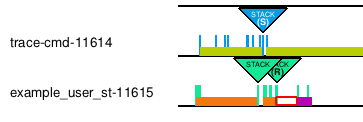

# Purpose

Allow code with access to the OpenGL widget (which paints the graph) to access the color table used to differentiate tasks
by color, a so-called PID color table.

# Main design objectives

- Simplicity
- KernelShark code similarity
- Safe access

# Solution

A getter function of a const reference to the color table the OpenGL widget uses was created in the HPP file of
`KsGLWidget` class.

# Usage

When developing something for KernelShark, e.g. a plugin, when one can access the OpenGL widget (class `KsGLWidget`),
usually by asking a main window for its graph pointer and through that get access to the OpenGL widget (via public
method `glPtr()` on `KsTraceGraph` object), ask for the PID color table via the new method. Doing so will return a
constant `KsPlot::ColorTable` reference, which can be used to get task's color.

Example: Stacklook can be configured to use task colors for its buttons, see figure 1.

Figure 1 - Each Stacklook button has a filling color corresponding to the task color

Make sure that any plugin using this modification is either preloaded via CLI or GUI before importing a session where such
plugin was active; or include defaults and an option to use functionality with this modification - failure to do so will
result in KernelShark crashing with a segmentation fault.

# Bugs

If a plugin using the new method is not loaded when KernelShark starts or before a session where it was active is loaded,
said session upon import will experience a segmentation fault when getting the color table and the program will crash. 
This seems to be a quirk with KernelShark when plugins aren't properly loaded when importing a session or when plugins are 
built outside the `src/plugins` directory.
- One could argue this goes against the safe access goal, but as outlined above, the problem lies with the "unstable" way
  KernelShark loads plugins upon session import - every other way of access is problem-free.

# Trivia

- This is the smallest modification, adding a single line of code.