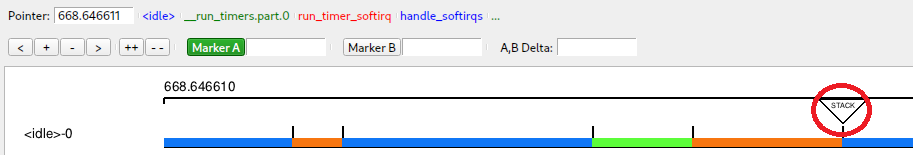

# Purpose

Allow plot objects to exhibit new behaviour when the mouse cursor hovers over them.

# Main design objectives

- KernelShark code similarity
- "Reuse what already works"
- OK performance

# Solution

Two new methods were added to the `KsPlot::PlotObject` class - public `mouseHover` and virtual private `_mouseHover`, 
mirroring the design of double-clicking on a plot object. Public method calls the private one if the plot object is 
visible and the private method starts with a default empty implementation. A child of PlotObject can override the private 
function to introduce new behaviour on mouse hover.

KernelShark will cycle through its plugin shapes container and check each on shape, if it should react to mouse hover.
Performance concerns are valid here, as many plugin shapes might slow down the program. There haven't been any problems
observed wth the current implementation though, which mimicks what double click event does and mouse hovers aren't as 
frequent as one might think to slow down the program in a significant way.

Source code change tag: `MOUSE HOVER PLOT OBJECTS`.

# Usage

Create a new object inheriting publicly from `KsPlot::PlotObject`. Override implementation of `_mouseHover` (and 
`distance`, which checks how far mouse is from the object, and most importantly, when it is above it). Upon hovering
over the custom object, the defined action should happen.

Example: Stacklook uses mouse hover over its buttons to set preview labels (another modification). See figure 1.

Figure 1 - Hovering over a Stacklook button (highlighted by the red circle) shows a bit of content of the kernel stack
in the preview.

# Bugs

No known bugs currently.

# Possible extensions

Cycling through every plot object is rather crude and simple, if there was a better implementation of plugin objects'
faster lookup (though most likely needing more memory), it'd be nice.
 - Maybe a sort of grid to limit the plugin objects to be checked could be nice, though that is a huge undertaking.

# Trivia

- This was the first time author has ever seen the concept of virtual private functions in C++.