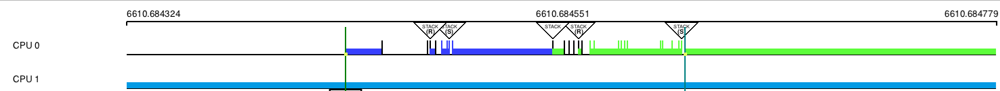
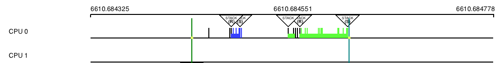

# Purpose

Allow code (plugin or internal to KS) to set a bit in the visibility mask of an entry to disable drawing of taskboxes during graph
draws.

# Main design objectives

- Simplicity
- KernelShark code similarity
- Disallow `ftrace/kernel_stack` and `couplebreak/sched_waking[target]` events to show fake work done on a CPU or a task graph.

# Solution

New visibility field mask (in the same enum as KS_PLUGIN_UNTOUCHED_MASK), which is propagated to bins from their entries and when the
graph is being drawn, don't draw a taskbox, which would begin or end at bins with this mask-bit being unset.

The modification is made as a "Best Effort" bug fix. A more refined fix is left as an extension.

## Solution at play

Outside of the KernelShark modifications, a new plugin called "NoBoxes" was created, which activates this behaviour.

# Usage

When developing something for KernelShark, e.g. a plugin, one can set the bit in an entry's `visible` field to activate
the behaviour.

Example: NoBoxes plugin at work (descriptions are taken from the plugin's user manual):

Figure 2 - noboxes are OFF.

In this figure, *ftrace/kernel_stack* is the event with a large vertical line on the right, *couplebreak/sched_waking\[target\]* is the
event with a large vertical line on the left; kernel stack event produces a large box until the end of the graph, waking target, while
not doing any actual work on the CPU, makes it seem it does. There is also a large taskbox in the CPU graph below,
which starts at another kernel stack event. There are other kernel stack events drawing taskboxes, like the one between the two
highlighted events, drawing a blue taskbox.

Figure 3 - noboxes are ON.

In ths figure, *ftrace/kernel_stack* is the event with a large vertical line on the right, *couplebreak/sched_waking\[target\]*
is the event with a large vertical line on the left; there are no taskboxes stemming from or going into them. The bottom line
is also gone (but may pop in and out on window updates, e.g. mouse hover that changes the window's visuals).

Source code change tag: `NOBOXES`.

# Bugs

The implementation might look good on paper, but in practice, drawing of a graph tends to sometimes draw what shoudn't be drawn,
resulting in taskboxes popping in and out of existence with just a mouse hover. It is most likely in part due to the "1 bin = 1 pixel"
implementation of bins, which works great, but it also means any pixel updates on the screen can cause confusion for the graph. 

# Trivia

- This modification spawned from a desire for a bugfix, yet KS just didn't have the tools necessary.
- Modification is only possible, because KernelShark doesn't have a mask for all 8 bits of the visibility field, but there are
  extensions expected.