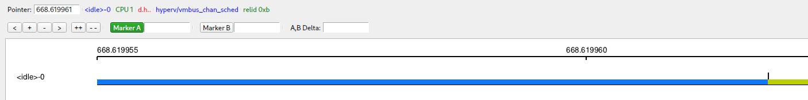
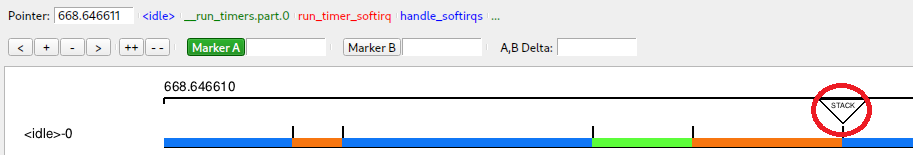

# Purpose

Allow code with access to the KernelShark graph to change the preview labels (figure 1).

# Main design objectives

- Simplicity
- KernelShark code similarity
- Safe access

# Solution

Introduced public method `setPreviewLabels` to the `KsTraceGraph` class, which every stream has access to. This method
expects 5 QString arguments, but by default they are set to an empty string. Behaviour was copied from
how labels are set when hovering over an entry in the graph. The method just sets each of the five labels
the graph has to the given string.

# Usage

When developing a plugin and having access to the graph (most likely via the public `graphPtr()` method on main window),
just ask the graph via the new method to update its preview labels. Example: Stacklook plugin uses this to display
a few of the kernel stack entries when mouse hovers over its button (mouse hover reactions of plot objects are another 
modification). See figure 2.

Figure 2 - Stacklook button (highlighted by the red circle) asks preview labels to change upon mouse hover to some 
information

# Bugs

If a plugin using the new method is not loaded when KernelShark starts or before a session where it was active is loaded,
said session upon import will experience a segmentation fault when setting text to a label and the program will crash. 
This seems to be a quirk with KernelShark when plugins aren't properly loaded when importing a session or when plugins are 
built outside the `src/plugins` directory.