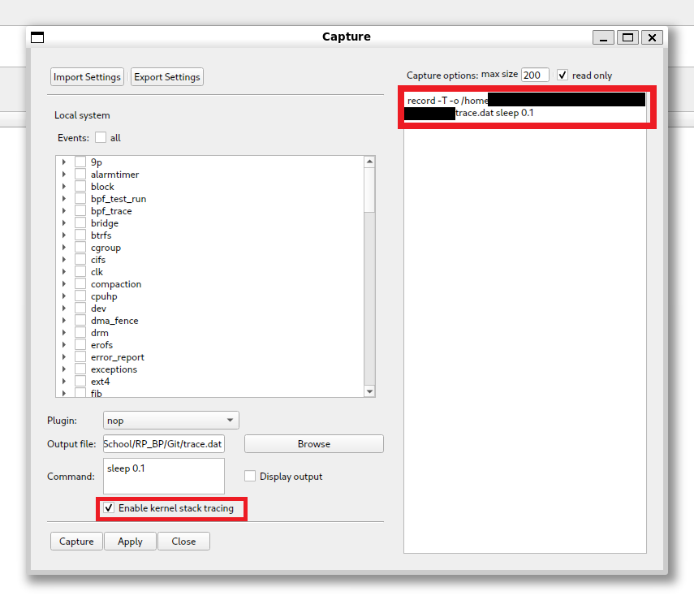

# Purpose

Give KernelShark an option in its Record window to record kernel stack trace events.

# Main design objectives

- Easy to use
- KernelShark code similarity

# Solution

Introduced a checkbox in the Record window (`KsCaptureDialog` class) in its bottom half, which asks if the user wishes to
enable kernel stack tracing. If checked, then the invoked trace-cmd receives command-line argument `-T`,
which enables kernel stack traces after each event recorded - result of this are `ftrace/kernel_stack` events interspersed
in the trace data.

Source code change tag: `RECORD KSTACK`.

# Usage

After opening KernelShark, open the Record window. There you'll find a a checkbox with label "Enable kernel stack tracing".
Check it to enable kernel stack recording. Afterwards, record a trace and open it in KernelShark. There'll be
`ftrace/kernel_stack` events after each non-custom event.

Changes are visible in the Record window as seen in figure 1. Red rectangles highlight where to look for modification (black bars censor author's personal filepaths).

Figure 1 - Record Kstack in action

# Bugs

No known bugs.

# Trivia

- Modification is very small - exactly 7 lines of code added to 2 files.
- Originally, the goal was getting kernel stack for `sched/sched_switch` and `sched/sched_waking` events, but
  trace-cmd doesn't include an option to record kernel stack only for a select few events.