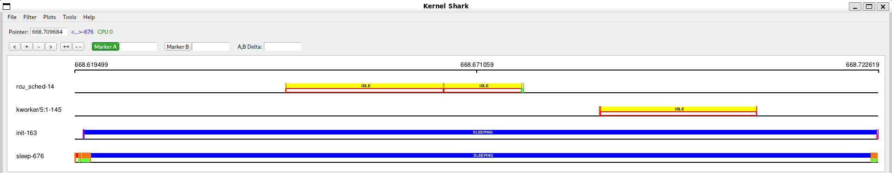
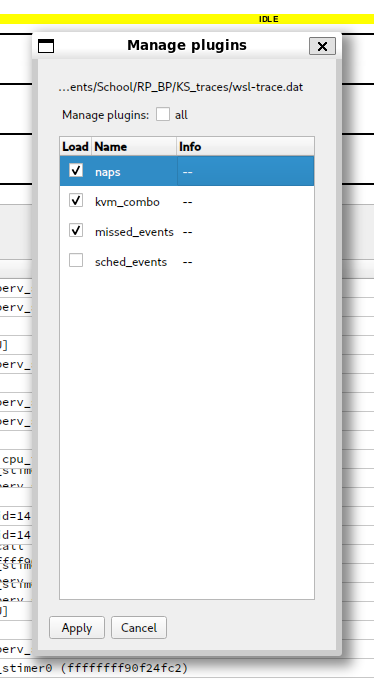
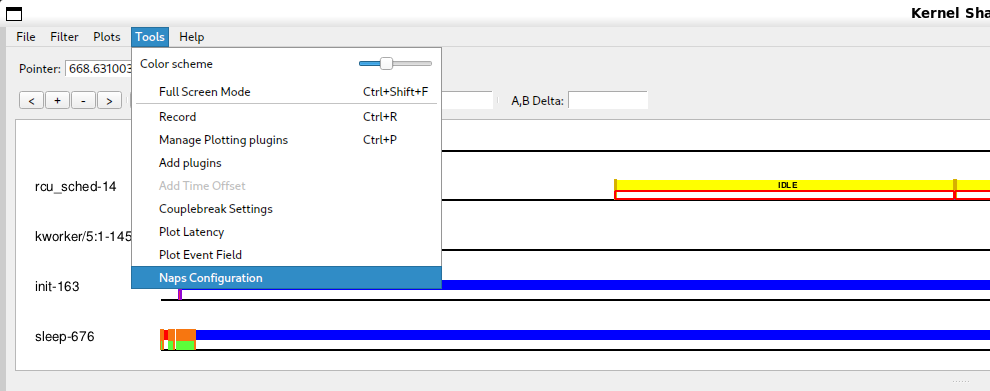
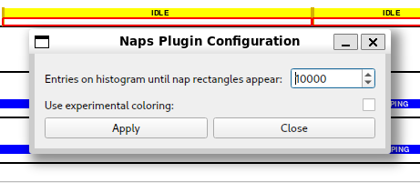
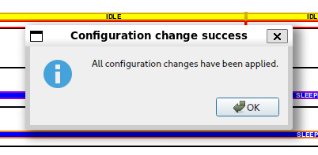

# Intro

This document serves as a simple to grasp manual for the "naps" KernelShark plugin.

Seek information on how to build and install the software in the project's [README](../../README.md).

# "How do I enable/disable naps?"

Enabling the plugin is very simple. All one has to do is open KernelShark and navigate to 
`Tools > Manage Plotting plugins` toolbar menu button. If the plugin was loaded via the command-line interface,
it will be shown in the list of plotting plugins as a checkbox plus the name, checkbox already being ticked.
If not, it is possible to search for the plugin via provded `Tools > Add plugin` button - it's sufficient to
find the symlink, but searching for the actual shared object file is possible too. As you can see, the plugin
follows standard KernelShark plugin loading behaviour.

Ticked checkbox means the plugin is enabled, empty checkbox means the plugin is disabled.

# "How do I use naps?"

## Configuration

If the plugin is enabled, additional button will appear in `Tools` menu with the label `Naps Configuration` (figure 3).
Clicking on it will show a window dialog (figure 4), which will house configuraton options for the plugin. One of the
two configuration options available for this plugin is the maximum amount of entries visible on the graph before the
plugin is allowed to work. This configuration option can help if there are either not enough visible plugin shapes
for a current zoom level or if there are too many and program memory is is too great.

The other configuration option is whether to color the nap rectangle's top and bottom outlines the same color as
KernelShark uses for the task (figure 5). Otherwise, the same color as the one used for the filling will be used 
(figure 6). This can be toggled via a simple checkbox.

Clicking on `Apply` button will confirm changes made to the configuration and close the window, showing a pop-up 
(figure 7) if the the operation was successful. Clicking on the `Close` button or the X button in the window header will close the window without applying any changes. Changes made to a window that hasn't applied them to the 
configuration will be lost and upon reopening, the window will again show what's in the currently applied 
configuration.

Regarding KernelShark's sessions, the configuration is NOT persistent and options included before will have to be
adjusted again upon a new session or trace file load.

## In the graph

To view naps in a graph of a trace, let KernelShark show you task plots. The plugin will automatically draw
rectangles between switch and waking events, coloring them according to the previous state of the task that will
then switch to another task. Top and bottom outlines of the rectangles are colored using the same color, or, if
turned on in the configuration, using the task's own color. If the rectangle is wide enough, then the full name
of the previous state of the task will be displayed as well (figure 8).

The rectangles will be visible as long as the zoom level allows two entries belonging to the same nap to also be
visible & as long as there aren't too many entries visible on the graph (this can be adjusted in the configuration).

The rectangles cannot be interacted with in any capacity.

# Bugs & glitches

No known bugs, but there were plenty of unexpected surprises during plugin testing - if more were discovered,
contact the author via e-mail `djsebofficial@gmail.com`.

# Recommendations

It is recommended by the author to turn on couplebreak in KernelShark to allow greater compatiblity with other
plugins, especially sched_events.

It is recommended to not set the histogram limit in the configuration too high as to not make the plugin use
too much memory with many nap rectangles being present.

While KernelShark's sessions work, they are a little buggy. This plugin attempts its best to not get in the way of
their inner logic, but a warning should be issued that if the plugin isn't loaded beforehand, there might be
unexpected behaviours, e.g. loading a session when the plugin was active won't add the plugin's menu to the
`Tools` menu.