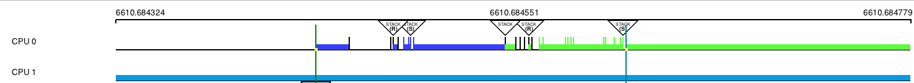

# Intro

This document serves as a simple to grasp manual for the "noboxes" KernelShark plugin.

# "How do I build and install this plugin?"

## Prerequisites

- CMake of version at least *3.1.2*
- KernelShark and its dependencies
  - version *2.6.0-numatv* and higher for custom KernelShark
- Doxygen for documentation

## Compatibility

Plugin is compatible with KernelShark's **custom** version *2.6.0-numatv* and higher.
Unmodified KernelShark usage is impossible, as the plugin needs a newly defined visibility mask
and its behaviour.

No other dependencies are necessary, except Doxygen for documentation.

## Build and install only this plugin

1. Set your working directory in terminal as the build directory (best created in the project's root directory (see 
   [README](../../README.md)), if not already present).
2. Run `cmake ..` command (if the main `CMakeLists.txt` file isn't in the parent folder, provide cmake with its
   valid location).
   - If **Doxygen documentation** is desired, include `-D_DOXYGEN_DOC=1` in the command.
   - By default, the **build type** will be `RelWithDebInfo` - to change this, e.g. to `Release`, use the option 
     `-DCMAKE_BUILD_TYPE=Release`.
   - If **KernelShark source files** aren't in the relative path `../KS_fork/src` from this directory, use
     the option `-D_KS_INCLUDE_DIR=[PATH]`, where `[PATH]` is replaced by the path to KernelShark source files.
   - If **KernelShark's shared libraries** (`.so` files) aren't in `/usr/local/lib64`, use the option
     `-D_KS_SHARED_LIBS_DIR=[PATH]`, where `[PATH]` is replaced by the path to KernelShark shared libraries.
3. Run `make` while still in the `build` directory.
   - If only a part of building is necessary, select a target of your choice.
   - Just running `make` builds: **the plugin** (target `noboxes`), **symlink** to the plugin SO (target 
     `noboxes_symlink`) and, if specified, the **Doxygen documentation** (target `docs`).
4. (**Installation**) Plug in the plugin into KernelShark - either via KernelShark's GUI or when starting it via the 
   CLI with the `-p` option and location of the symlink or the SO itself.
   - **IMPORTANT**: Always install/load the plugin before loading a session where said plugin was active! Failure to do
     so may result in KernelShark's crash.

Use `make clean` to remove built binaries.

## Building KernelShark from source and this plugin with it

1. Ensure all source files (`.c`, `.cpp`, `.h`) of NoBoxes are in the `src/plugins` subdirectory of your KernelShark 
   project directory.
2. Ensure the `CMakeLists.txt` file in said subdirectory contains instructions for building the plugin (copy the style 
   of other plugins, e.g. sched_events).
3. Build KernelShark (plugins are built automatically).
4. (**Installation**) Start KernelShark. Plugins built this way will be loaded automatically. If that for some reason 
   failed, look for the SO as for any other default-built KernelShark plugin, again in GUI or via the CLI.

## WARNING - loading plugin twice

If you have two or more versions of the plugin, do **NOT** load them at the same time - doing so **WILL CRASH** the 
program. Use either one or the other, but **NEVER BOTH**.

# "How do I enable/disable noboxes?"

Enabling the plugin is very simple. All one has to do is open KernelShark and navigate to 
`Tools > Manage Plotting plugins` toolbar menu button. If the plugin was loaded via the command-line interface,
it will be shown in the list of plotting plugins as a checkbox plus the name, checkbox already being ticked.
If not, it is possible to search for the plugin via provded `Tools > Add plugin` button - it's sufficient to
find the symlink, but searching for the actual shared object file is possible too. As you can see, the plugin
follows standard KernelShark plugin loading behaviour.

Figure 1.

Ticked checkbox means the plugin is enabled, empty checkbox means the plugin is disabled.

# "How do I use noboxes?"

Simply having NoBoxes enabled will make some taskboxes (the rectangles KernelShark draws between its bins) not be drawn or
be skipped when looking where to end a taskbox - on both task
and CPU graphs.

To better visualise the differences when plugin is turned off and on, compare the two figures below:

Figure 2 - noboxes are OFF.

In this figure, *ftrace/kernel_stack* is the event with a large vertical line on the right, *couplebreak/sched_waking\[target\]* is the
event with a large vertical line on the left; kernel stack event produces a large box until the end of the graph, waking target, while
not doing any actual work on the CPU, makes it seem it does. There is also a large taskboxe going from the CPU graph below,
which starts at another kernel stack event. There are other kernel stack events drawing taskboxes, like the one between the two
highlighted events, drawing a blue taskbox.

Figure 3 - noboxes are ON.

In ths figure, *ftrace/kernel_stack* is the event with a large vertical line on the right, *couplebreak/sched_waking\[target\]*
is the event with a large vertical line on the left; there are no taskboxes stemming from or going into them. The bottom line
is also gone (but may pop in and out on window updates, e.g.
mouse hover that changes the window's visuals).

## Issues

The plugin is fine, but the implementation is mostly a best-effort on KernelShark side - the plugin only activates
the behaviour, KernelShark controls what it means. If the taskboxes look a little strange, look at the KernelShark side
and contact the NOBOXES modification's developer(s).

## Using noboxes as a library

See technical documentation, as this is not intended usage of the plugin and such usage explanations will be omitted.

# Bugs & glitches

No known bugs, but there were plenty of unexpected surprises during plugin testing - if more were discovered,
contact the author via e-mail `djsebofficial@gmail.com`.

# Recommendations

A few recommendations of usage by the author for the smoothest user experience.

Always preload NoBoxes before loading a session. It can save the program from nasty surprises.