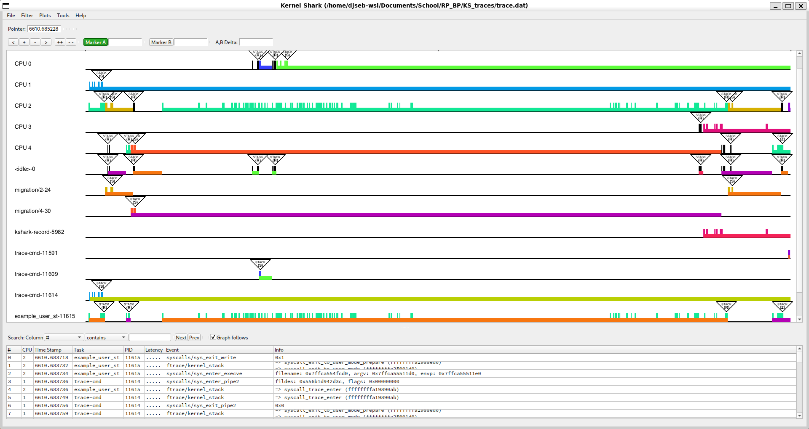
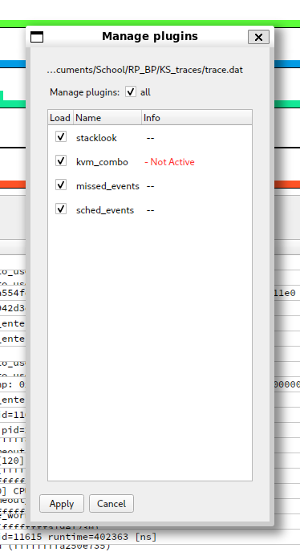
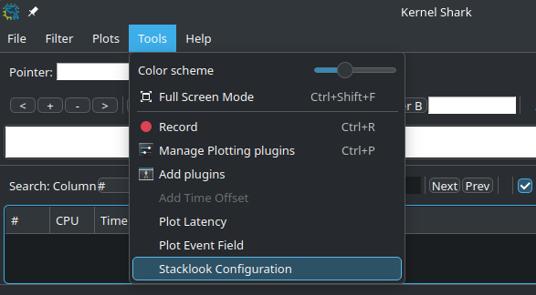
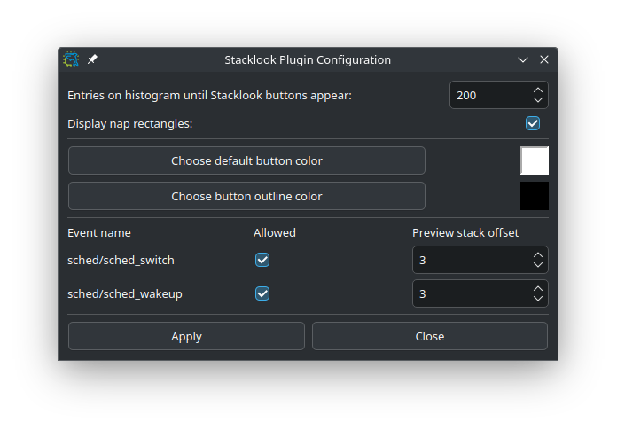
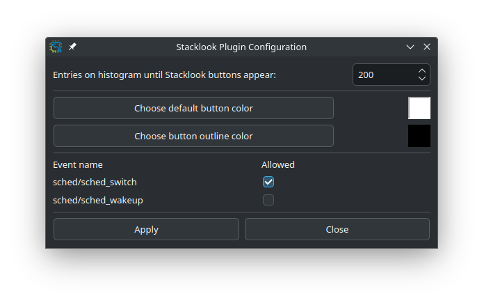
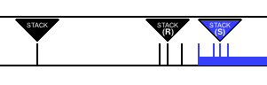
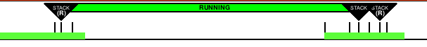
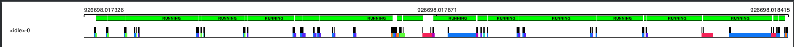
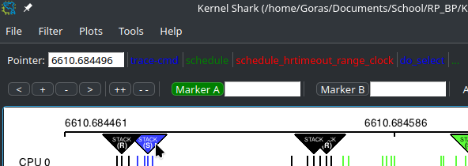
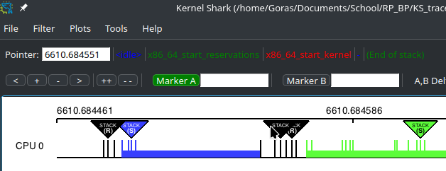

# Intro

This document serves as a simple to grasp manual for the "naps" KernelShark plugin.

Figure 1.

# "How do I build and install Stacklook?"

## Prerequisites

- CMake of version at least 3.1.2
- KernelShark and its dependencies
  - version *2.4.0-couplebreak* and higher for custom KernelShark
  - version *2.3.2* for unmodified KernelShark

## Compatibility

Plugin is compatible with KernelShark's **custom** version *2.4.0-couplebreak* and higher.
Unmodified KernelShark usage is achievable through a build argument. Unmodified KernelShark removes
these features from the plugin:
- Buttons optionally being the same color as the task is in the graph
- Mouse hover showing a preview of the kernel stack with an adjustable stack offset for it in the configuration

No other dependencies are necessary, except maybe the standard libraries of C and C++.

## Build and install only this plugin

1. Set your working directory in terminal as the build directory (best created in the project's root directory (see
   [README](../../README.md)), if not already present).
2. Run `cmake ..` command (if the main `CMakeLists.txt` file isn't in the parent folder, provide cmake with its
   valid location).
   - If using an unmodified KernelShark copy, add `-D_UNMODIFIED_KSHARK` to the command.
   - If **Doxygen documentation** is desired, include `-D_DOXYGEN_DOC=1` in the command.
   - By default, the **build type** will be `RelWithDebInfo` - to change this, e.g. to `Release`, use the option `-DCMAKE_BUILD_TYPE=Release`.
   - If **Qt6 files** aren't in `/usr/include/qt6`, use the option `-D_QT6_INCLUDE_DIR=[PATH]`, where `[PATH]` is 
     replaced by the path to the Qt6 files.
     - Build instructions still expect that the specified directory has same inner structure as the default case (i.e. 
       it contains `QtCore`, `QtWidgets`, etc.).
   - If **KernelShark source files** aren't in the relative path `../KS_fork/src` from this directory, use
     the option `-D_KS_INCLUDE_DIR=[PATH]`, where `[PATH]` is replaced by the path to KernelShark source files.
   - If **KernelShark's shared libraries** (`.so` files) aren't in `/usr/local/lib64`, use the option
     `-D_KS_SHARED_LIBS_DIR=[PATH]`, where `[PATH]` is replaced by the path to KernelShark shared libraries.
3. Run `make` while still in the `build` directory.
   - If only a part of building is necessary, select a target of your choice.
   - Just running `make` builds: **the plugin** (target `stacklook`), **symlink** to the plugin SO (target 
     `stacklook_symlink`) and, if specified, the **Doxygen documentation** (target `docs`).
4. (**Installation**) Plug in the plugin into KernelShark - either via KernelShark's GUI or when starting it via the 
   CLI with the `-p` option and location of the symlink or the SO itself.

Instructions will remove the binary upon running `make clean`, but won't remove the symlink.

## Building KernelShark from source and this plugin with it 

1. Ensure all source files (`.c`, `.cpp`, `.h`) of Naps are in the `src/plugins` subdirectory of your KernelShark project directory.
2. Ensure the `CMakeLists.txt` file in said subdirectory contains instructions for building the plugin (copy the style of other Qt-using GUI plugins).
3. Build KernelShark (plugins are built automatically).
4. (**Installation**) Start KernelShark. Plugins built this way will be loaded automatically. If that for some reason failed, look for the SO as for any other default-built KernelShark plugin, again in GUI or via the CLI.

# "How do I enable/disable Stacklook?"

Enabling the plugin is very simple. All one has to do is open KernelShark and navigate to 
`Tools > Manage Plotting plugins` toolbar menu button. If the plugin was loaded via the command-line interface,
it will be shown in the list of plotting plugins as a checkbox plus the name, checkbox already being ticked.
If not, it is possible to search for the plugin via provded `Tools > Add plugin` button - it's sufficient to
find the symlink, but searching for the actual shared object file is possible too. As you can see, the plugin
follows standard KernelShark plugin loading behaviour.

Figure 2.

Ticked checkbox means the plugin is enabled, empty checkbox means the plugin is disabled.

# "How do I use Stacklook?"

## Configuration

## In the graph

# Bugs & glitches

No known bugs, but there were plenty of unexpected surprises during plugin testing - if more were discovered,
contact the author via e-mail `djsebofficial@gmail.com`.

# Recommendations

A few recommendations of usage by the author for the smoothest user experience.

It is recommended to not set the histogram limit in the configuration too high as to not make the plugin use
too much memory with many of stacklook's buttons being present.

While KernelShark's sessions work, they are a little buggy. This plugin attempts its best to not get in the way of
their inner logic, but a warning should be issued that if the plugin isn't loaded beforehand, there might be
unexpected behaviours, e.g. loading a session when the plugin was active won't add the plugin's menu to the
`Tools` menu.

# Manual for Stacklook

## Using Stacklook in KernelShark

### Configuration

Plugin configuration can be done at any time, even before
any trace file is loaded. To use it, simply open the dialog
window through "Tools > Stacklook Configuration" in the
main window. There can be only one window open at a given time.

Configuration path as a picture:

Each setting has an explanation to go along
with it, but usual control elements work as expected:
check boxes are used for toggling, spin boxes adjust numerical
values, buttons with color next to them serve to open a color
dialog window and choose a different color. The "Apply"
button will save the changes made - if not pressed, any
changes made won't take effect. Only saved changes show up
in the control elements (e.g. a feature that is turned off will
have its check box unchecked). The "Close" button and top-right
corner "X" button will close the dialog without additional
actions.

Settings are session-specific, so to remember them, use the
session export/import feature of KernelShark.

With everything enabled:

With unmodified KernelShark specified and nap rectangles disabled:

### Use in a plot

To use the plugin, have a trace file ready which includes
*sched/sched_switch* and *sched/sched_waking* event entries.

After loading the plugin, zoom until less than the configured
number of visible entries are visible in the histogram plot.
If there are any of the above entries, a button will show up, 
colored like the task the event is for.

Since the color theme can be changed in KernelShark, the
buttons respect this possibility, albeit they need the user
to zoom out and back in for this to take effect.

Excuse the lower resolution :\)

If toggled on via configuration and build, nap rectangles
will also show up after the number of entries condition is
satisfied. Each of them has outlines the color of the task the
*sched/sched_switch* entry is from & their inner color is
decided according to the below list:
- **S** - sleeping: **blue**
- **D** - uninterruptible (disk) sleep: **red**
- **R** - running: **green**
- **I** - idle: **yellow**
- **T** - stopped: **cyan**
- **t** - tracing stop: **brown**
- **X** - dead: **magenta**
- **Z** - zombie: **purple**
- **P** - parked: **orange**

How a nap rectangle looks like:

If *ftrace/kernel_stack* events were not collected, no
Stacklook buttons will be shown, but nap rectangles will
be displayed even if no stack information has been collected, as
they don't at all rely on it.

As visible here:

Else, upon mouse hover/move over a button, the name of
the task and three items from the top of the kernel stack
will be shown. These three items can be configured to start
from the very first stack item or they can be offset in the
configuration by a certain amount. If there are no entries
to display (or we are going over the stack), dashes will be
shown instead and the last label in the preview will notify
us that we are seeing the end of the stack.

Sched_switch preview, offset is set to 3:

Preview, offset is set to reach end of kernel stack:

Moving away from the button's boundaries will show nothing, i.e.
the labels will be cleared.

Double-clicking on a button will bring up a new window,
which will show the full kernel stack, either as raw text
or in the form of a list of strings. Both will have "(top)"
written above the stack, signifying where the top of the
stack is. It is possible to toggle between the raw text
view and the list view using two radio buttons above the
view area. On the top of the window is a small message
with the name of the task from which we had the kernel
stack traced. Right below it is a message specific to an
event - sched_switches get information about their prev_state,
sched_wakings just reiterate that the task has woken up.

The window can be closed with the "Close"
button at the very bottom of the window or with the "X"
button of the window's header. Last option is to close
the main KernelShark window, which will close all of
Stacklook's opened windows.

There can be more than one window opened for a single
event and there can be more windows with different
events open (performance shouldn't be demanding, but
it isn't recommended to open hundreds upon hundreds).

## Using Stacklook as a library

### It's not really a library

Stacklook was built as a standalone piece of
software, not meant as a library (it is a shared library
solely because this is what KernelShark expects).

Still, since there are header files, it is good to
mention what is in them just in case it is needed.

### What's in the header files?

I recommend looking into the **technical Doxygen**
**documentation**. Below are only short summaries
of each member of header files.

In **stacklook.h**:
- Plugin context struct `plugin_stacklook_ctx`, which
  serves as a sort of plugin-wide global variable collection.
  It stores event IDs of collected events, container of
  collected events and a pointer to a collection of
  plugin's opened windows.
  
  A possible extension could be a collection of plugin's
  buttons so that one can manipulate them from anywhere.

- Global functions:
    * `get_font_ptr` - getting a pointer to KernelShark's
      font
    * `draw_plot_buttons` - draw handler for drawing buttons
      on the plot
    * `plugin_set_gui_ptr` - gets a pointer to KernelShark's
      main window during plugin load
    - Last five are defined in C++, first one in C. This is
      due to the necessities of using all of them in C code,
      but them needing to work with C++ structures.

In **SlButton.hpp**:
- Class `SlTriangleButton`, used for drawing the buttons.
  It is also responsible for the necessity of modified
  KernelShark build, due to it having a mouse hover action
  defined. It is also used to draw the buttons in a way
  which makes their parts not bleed into each other,
  thanks to it being a composite of other plot objects.

  This class also houses all logic of plugin's buttons'
  inner workings. As a child of the general plot object
  it can be used in graphs. In fact, it is, without this
  plugin's overall context, just a button that can do
  actions like a plot object and stores which entry it is
  gaining data from.

In **SlDetailedView.hpp**:
- Class `SlDetailedView`, class that represents a window
  with more detail about a kernel stack entry of an event.
  Class itself holds a pointer to the main KernelShark
  window and a pointer to all opened windows. Otherwise
  it is mostly composed of other Qt objects.

In **SlConfig.hpp**:
- Usings:
  * `allowed_t` - boolean for if an event is allowed to have
    a button displayed above its entries
  * `event_name_t` - string for event names
  * `events_meta_t` - map of names to plugin meta information,
    which depends on whether `_UNMODIFIED_KSHARK` is set or not
- Usings in effect only if `_UNMODIFIED_KSHARK` is NOT set:
  * `depth_t` - integer specifying offset into the kernel
    stack, used for the preview
  * `event_meta_t` - pair of `allowed_t` and `depth_t`, creating
    the meta type
- Class `SlConfig`, plugin configuration singleton object. Houses
  configurable values, but only lets them be read. Changes
  to it can be made only via `SlConfigWindow` in the GUI. 
- Class `SlConfigWindow`, Qt widget, child of the main window.
  Provides GUI elements to manipulate the `SlConfig` object.

In **SlPrevState.hpp**:
- Static constant map `LETTER_TO_NAME` which uses prev_state
  single-letter abbreviated names as keys for the full name.
- Global functions:
  * `get_switch_prev_state` - returns a single character-long
    C++ string with the abbreviated name of the prev_state
    of the sched_switch event entry in the argument
  * `get_longer_prev_state` - returns a C++ string with the
    full name of the prev_state of the sched_switch event entry
    in the argument

In **SlNapRectangle.hpp**:
- Class `SlNapRectangle`, a KernelShark plot object used for
  drawing nap rectangles. Nap rectangles cannot be interacted
  with and should only be drawn as an interval plot between
  a sched_switch and sched_waking events.